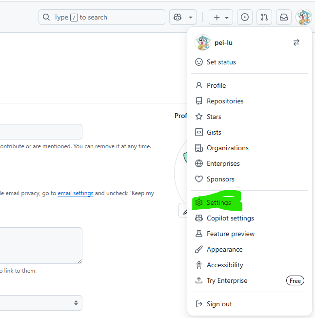
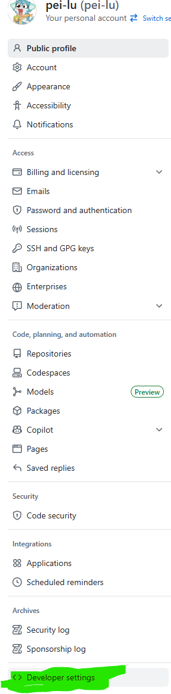
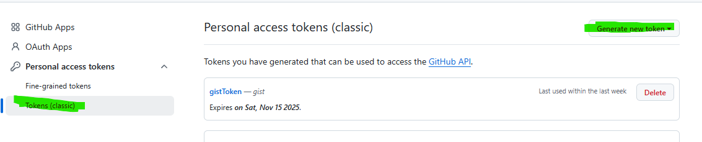
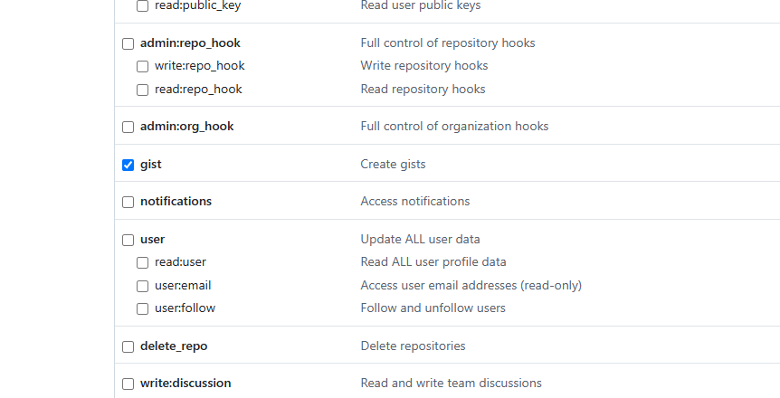
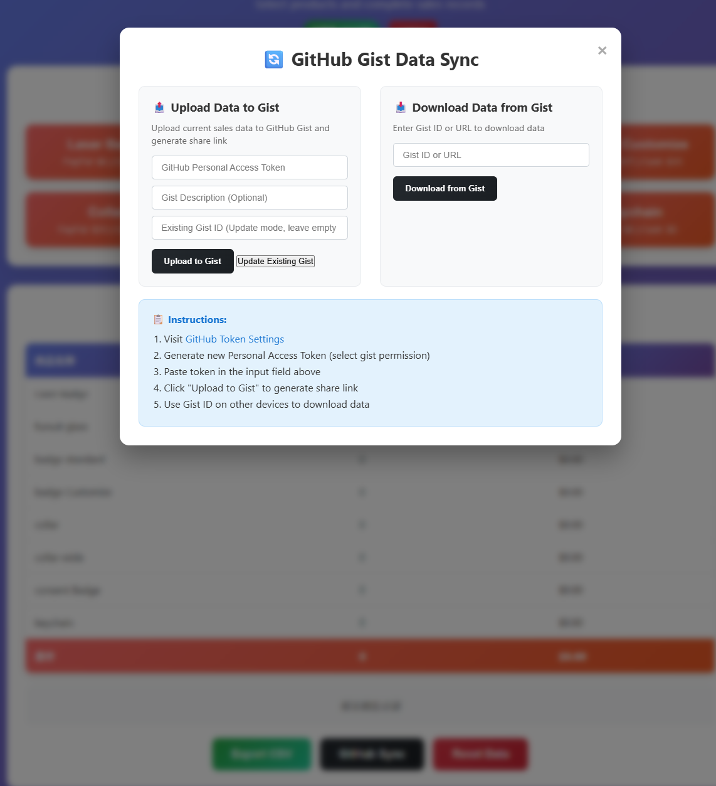

[Link to main website](https://pei-lu.github.io/HW_Accouting/)

# 使用说明
## ！警告 本工具完全ai生成 不代表本人真实代码水平（真实水平更差）！

## 数据同步
数据同步功能由 gist实现，需要每次手动输入gist id 做好备份。 不适合用于较大规模的商业数据同步， 更多只是用于漫展/兽展临时出摊使用

使用前需要  
1. 进入设置  

2. 生成 gist token  
  
  
  
3. 记住这个token 并且！！！绝对不要分享出去！！！别人要用别人自己生成
并在网页工具里使用它

## 工具使用
1. 其他功能太简单我就不讲了，界面已经很清晰了 主要说一下同步方式  
2.   
点击github sync之后 用上面的token去生成一个新的记录账单，会自动创建一个gist仓库，并生成一个gist id
本次贩售之中请使用同一个gistid，这样也可以多设备同步。新创建就upload 更新就update

## 贩售内容更换
1. fork 本repo  
2. 打开merchList.json 把自己要贩售的商品替换进去就可以了  
3. 在自己的github里面重新publish page或者用别的方法host 服务都可以。[教程详见此处](https://docs.github.com/en/pages/quickstart)

## 密码更改
1. 打开 button_Func.js 文件  
2. 找到第13行：const CORRECT_PASSWORD = "Vender2025";  
3. 将 "Vender2025" 替换为您想要的新密码  
4. 保存文件
---

# User Guide

## ⚠️ Warning: This tool is completely AI-generated and does not represent my actual coding skills (my real skills are worse)!

## Data Synchronization
Data synchronization is implemented using gist, requiring manual input of gist id each time for backup. Not suitable for large-scale commercial data synchronization, mainly for temporary booth use at conventions/furry conventions.

Before using, you need to:
1. Go to settings  

2. Generate gist token  
  
  
  
3. Remember this token and NEVER share it!!! Others should generate their own
and use it in the web tool

## Tool Usage
1. Other functions are too simple to explain, the interface is already very clear. Mainly talking about synchronization method  
2.   
After clicking github sync, use the token above to generate a new billing record, which will automatically create a gist repository and generate a gist id
Please use the same gist id throughout this sales session, so you can also sync across multiple devices. New creation is upload, updates are update

## Changing Sales Content
1. Fork this repo  
2. Open merchList.json and replace the products you want to sell  
4. Republish the page in your own github or use other methods to host the service. [Tutorial details here](https://docs.github.com/en/pages/quickstart)
